# Mohammed Sahil Khan

**Full-Stack Engineer** — building at the intersection of web, data, and AI

---

## About

Engineer working across **Typescript, SQL, and modern web frameworks** — React, Node.js, Next.js.
My work spans **full-stack apps, backend systems, and AI/computer vision research**.

- Building real-time and collaborative platforms end-to-end
- 700+ problems solved on LeetCode
- Into films and storytelling outside of code

---

## Tech Stack

---

## GitHub Stats

---

## Open Source

- **[turborepo#10579](https://github.com/vercel/turborepo/pull/10579)** — fixed broken Tailwind CSS styling in the `with-tailwind` example

---

